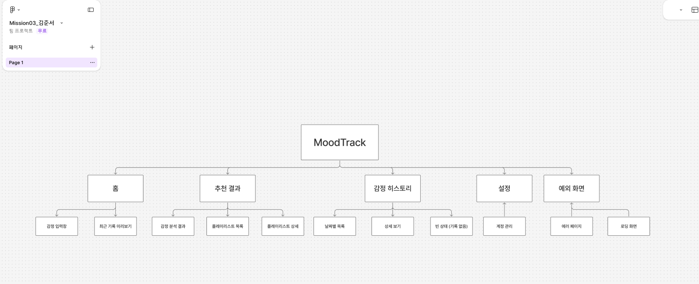
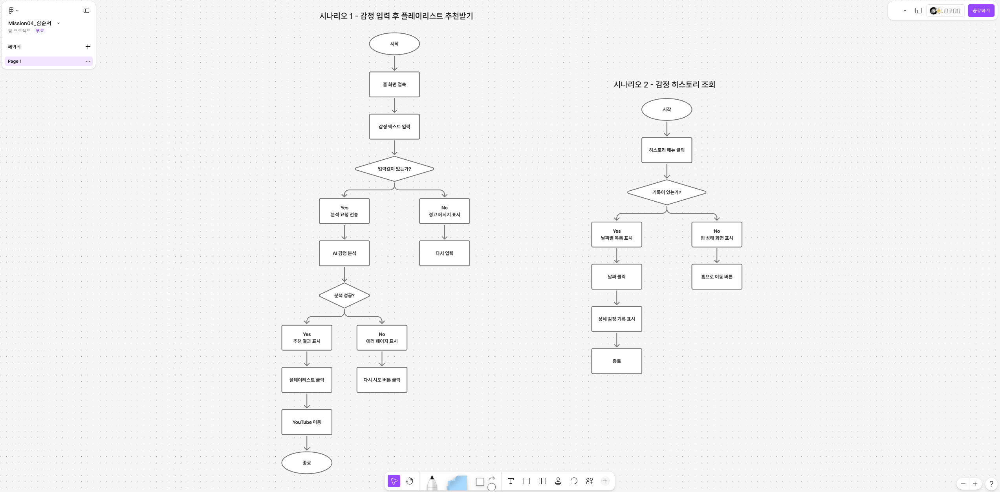
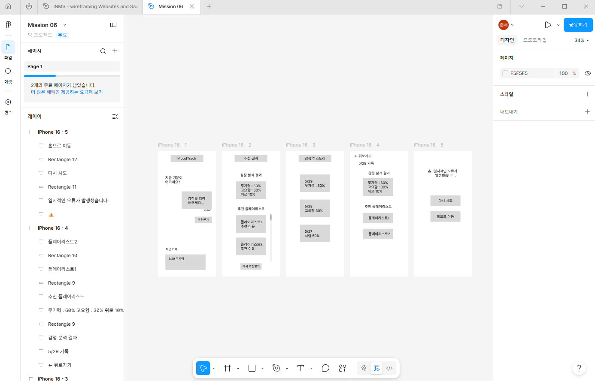

# 멋쟁이사자처럼 PBL - 기획 트랙

## 자기소개
- 이름: 김준서
- 파트: 기획 (Product Manager)
- 관심 분야: 음악, LLM, 웹

## PM 강의를 듣고 배운 점
- (챕터 1에서 인상 깊었던 내용 2~3줄)
- 프로젝트 계획 단계에서부터 차근차근 단단하게 쌓아야지 나중에 오류나 문제가 발생해도 대처를 잘 할 수 있다는 것을 알게되었습니다.
- 또한 고객 관점에서 보는 것이 중요하다는 걸 알게되었습니다.
- 프로젝트를 진행할 때에는 조원 모두의 진행 사항을 다 파악하고 있어야하고 프로젝트 진행 계획도 최대한 상세히 해야하는 것도 알게되었습니다.

## 이번 학기 목표
- 무엇을 만들더라도 확실하게 도움이 되는 방향으로 고객 뿐만 아니라 내 자신한테도 도움이 되도록 팀원과 협동해서 하나의 아이템을 만드는 것이 목표입니다.

## Mission 03 - IA 구조도

작성자: 김준서

## Mission 04 - 사용자 플로우

작성자: 김준서

## Mission 05 - 기능 명세서

작성자: 김준서

| 화면 ID | 화면명 | UI 요소 | Trigger | Action | 예외/제한 사항 |
|---|---|---|---|---|---|
| SCR-01 | 홈 화면 | 감정 입력창 | 텍스트 입력 시작 | 입력창 테두리 활성화, 글자 수 실시간 카운트 표시 | 최대 200자, 200자 초과 시 입력 차단 |
| SCR-01 | 홈 화면 | 감정 입력창 | 공백만 입력 후 버튼 클릭 | "감정을 입력해주세요" 안내 메시지 표시 | 공백만 입력 시 입력값 없음으로 처리 |
| SCR-01 | 홈 화면 | 추천받기 버튼 | 클릭 (입력값 있음) | 로딩 스피너 표시 후 AI 감정 분석 API 요청 전송 | 입력값 없으면 버튼 비활성화(gray) |
| SCR-01 | 홈 화면 | 추천받기 버튼 | 클릭 (입력값 없음) | 버튼 비활성 유지, 입력창 포커스 이동 | - |
| SCR-01 | 홈 화면 | 최근 기록 미리보기 | 화면 진입 | 최근 3개 감정 기록 날짜 및 감정 요약 표시 | 기록 없을 시 "아직 기록이 없어요" 텍스트 표시 |
| SCR-02 | 추천 결과 화면 | 감정 분석 결과 뱃지 | 화면 진입 | 감정 벡터(예: 무기력 60%, 고요함 30%, 위로 10%) 시각적으로 표시 | 분석 실패 시 SCR-05 에러 화면으로 이동 |
| SCR-02 | 추천 결과 화면 | 플레이리스트 카드 (1~3번) | 클릭 | 해당 Spotify/YouTube 링크를 새 탭으로 열기 | 링크 유효하지 않을 시 "링크 오류" 토스트 메시지 표시 |
| SCR-02 | 추천 결과 화면 | 추천 이유 텍스트 | 화면 진입 | 각 플레이리스트 카드 하단에 한 줄 추천 이유 표시 | 추천 이유 최대 50자 |
| SCR-02 | 추천 결과 화면 | 다시 추천받기 버튼 | 클릭 | 입력창 초기화 후 SCR-01 홈 화면으로 이동 | - |
| SCR-03 | 감정 히스토리 | 히스토리 목록 | 화면 진입 | 날짜 내림차순으로 감정 기록 목록 표시 | 기록 없을 시 빈 상태 화면 및 "감정을 기록해보세요" 메시지 표시 |
| SCR-03 | 감정 히스토리 | 날짜별 기록 카드 | 클릭 | SCR-04 히스토리 상세 화면으로 이동 | - |
| SCR-03 | 감정 히스토리 | 빈 상태 화면 | 화면 진입 (기록 없음) | "아직 기록이 없어요" 메시지 + 홈으로 이동 버튼 표시 | - |
| SCR-04 | 히스토리 상세 | 감정 분석 결과 | 화면 진입 | 해당 날짜 감정 벡터 및 추천된 플레이리스트 3개 표시 | 데이터 로딩 실패 시 "불러오기 실패" 메시지 + 재시도 버튼 표시 |
| SCR-04 | 히스토리 상세 | 뒤로가기 버튼 | 클릭 | SCR-03 히스토리 목록으로 이동 | - |
| SCR-05 | 에러 화면 | 에러 메시지 | 화면 진입 | "일시적인 오류가 발생했습니다" 메시지 표시 | - |
| SCR-05 | 에러 화면 | 다시 시도 버튼 | 클릭 | 이전 API 요청 재전송 | 3회 이상 실패 시 "잠시 후 다시 시도해주세요" 메시지로 변경 |
| SCR-05 | 에러 화면 | 홈으로 이동 버튼 | 클릭 | 입력값 초기화 후 SCR-01 홈 화면으로 이동 | - |

## Mission 06 - 와이어프레임 리뷰 & 피드백

작성자: 김준서

MoodTrack 서비스의 5개 핵심 화면에 대한 와이어프레임입니다.

## 리뷰 & 피드백

| 화면 | 확인 항목 | 결과 |
|---|---|---|
| SCR-01 홈 | 감정 입력창, 글자수 카운터, 추천받기 버튼 배치 | 반영 |
| SCR-02 추천 결과 | 감정 벡터, 플레이리스트 카드, 다시 추천받기 버튼 | 반영 |
| SCR-03 히스토리 | 날짜별 목록, 스크롤 구조 | 반영 |
| SCR-04 히스토리 상세 | 뒤로가기, 감정 벡터, 플레이리스트 | 반영 |
| SCR-05 에러 | 에러 메시지, 다시 시도, 홈으로 이동 버튼 | 반영 |

## 개선 피드백

| 화면 | 문제점 | 개선 방향 |
|---|---|---|
| SCR-01 | 추천받기 버튼 비활성 상태 미표현 | 입력값 없을 때 버튼 gray 처리 필요 |
| SCR-02 | 플레이리스트 카드 2개만 표시 | 3개 모두 표시되도록 수정 필요 |
| SCR-03 | 빈 상태 화면 누락 | 기록 없을 때 빈 상태 화면 추가 필요 |
| SCR-05 | 로딩 화면 별도 없음 | AI 분석 중 로딩 스피너 화면 추가 필요 |
